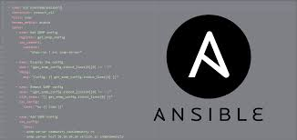

# Ansible

## What is Ansible?

  

Ansible is an open source automation platform. It's simple yet powerful. Ansible can help you with config management, deployment and task automation.

Ansible uses SSH which is assumed to be installed on all the systems you want to manage. Also it’s written in Python which needs to be installed on the remote host.

## What are Ansible Playbooks?

  

Ansible playbooks are highly customizable scripts that are used to execute a series of tasks and commands. 

A playbook is like a recipe or an instructions manual which tells Ansible what to do when it connects to each machine. Playbooks are written in YAML

## Files

[ping.yaml](ping.yaml) - Simple Ansible playbook to ping all hosts. 